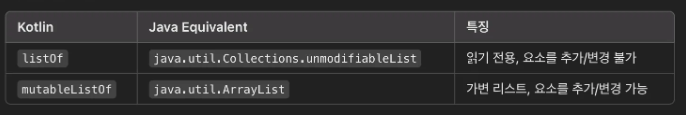
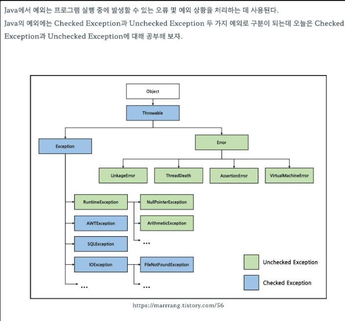

## 변수

**변경 가능한 변수와 변경 불가능한 변수**

- val(value) - 변경 불가능한 참조를 저장하는 변수, 자바로 따지면 Final 변수, 재정의할수없는
- var(variable) -  변경 가능한 참조

`기본적으로 모든 변수를 val 키워드를 사용해 불변 변수로 선언하고, 나중에 꼭 필요할 때만 var로 변경`

### 프로퍼티

멤버 필드와, 접근제한자(getter, setter)를 한데 묶어 프로퍼티라고 한다.

코틀린에서는 주 생성자 필드 생성이 프로퍼티가 된다. (val은 getter, var은 getter, setter 생성)

```kotlin
class Person (
	val name: String,
	var isMarried: Boolean
)

class Person3(
    val name: String,
    var age: Int,
    var isMarried: Boolean,
)

val person = Person3("강현수", 100, false)
println(person.name) //getter 사용
person.age = 10 //setter 사용
person.isMarried = true
```

`is로 시작되는 프로퍼티는 prefix get set이 붙지않고 이름 그대로 사용된다.`

### if문과 When문

**if문**

자바에서 if문은 statement지만 코틀린에서는 Expression이다.

statement : 프로그램의 문장, 하나의 값으로 도출 되지 않는다.

Expression : 하나의 값으로 도출되는 문장

```kotlin
fun getPassOrFail(score: Int): String {
    if(score < 0) {
        return "P"
    } else {
        return "F"
    }
}
```

**When문**

- 코틀린에서는 switch case가 사라졌고 대신에 when을 쓴다.
- when 역시도 statement다.
- switch 대신에 when을 쓴다.
- case 대신에 바로 값을 쓰고 화살표로 분기를 친다.
- default 대신에 else를 쓴다.

```kotlin

fun getGradeWithSwitch(score: Int): String {
    return when (score / 10) {
        9 -> "A"
        8 -> "B"
        7 -> "C"
        else -> "D"
    }
}

//코틀린에서는 특정 값만을 가지고 분기를 칠수있는게 아니라 다양한 조건을 가지고 분기를 칠 수 있다.
fun getGradeWithSwitch2(score: Int): String {
    return when (score) {
        in 90..100 -> "A"
        in 80..89 -> "B"
        in 70..79 -> "C"
        else -> "D"
    }
}

//코틀린은 한 분기안에서 여러가지 값을 ,로 분리하여 매칭할 수 있다.
fun judgeNumber(number: Int) {
    //number == 1 || number == 0 || number == -1
    when (number) {
        1, 0, -1 -> println("1또는 0또는 -1입니다.")
        else -> println("1, 0, -1이 아닙니다.")
    }
}

//코틀린에서 when을 값 없이 조건 분기로만 사용할 수 있다.
fun judgeNumber2(number: Int) {
    when {
        number == 0 -> println("주어진 숫자는 0입니다.")
        number % 2 == 0 -> println("주어지는 숫자는 홀수 입니다.")
        else -> println("주어지는 숫자는 홀수 입니다.")
    }
}
```

### Enum

enum 클래스 안에 프로퍼티, 메소드 정의가 가능하다.

```kotlin

//프로퍼티와 메서드가 있는 enum 클래스
enum class Color2(
    val red: Int, // 상수의 프로퍼티를 정의
    val green: Int,
    val blue: Int
) {
    RED(255, 0, 0), ORANGE(255, 165, 0), // 각 상수를 생성(프로퍼티 값 지정)
    YELLOW(255, 255, 0), GREEN(0, 255, 0),
    BLUE(0, 0, 255), INDIGO(75, 0, 130),
    VIOLET(238, 130, 238); //enum 클래스안에서 메서드 정의가 필요할때 상수목록과 메서드 사이에 ; 로 구분을 해줘야 한다.

    fun rgb() = (red * 256 + green) * 256 + blue
}

fun main() {
		println(Color2.RED) //RED
    println(Color2.RED.red) //255
    println(Color2.RED.green) //0
    println(Color2.RED.blue) //0
    println(Color2.RED.rgb())
}
```

**when과 enum 같이 사용**

```kotlin
fun getWarmth(color: Color2) = when (color) {
    Color2.RED, Color2.ORANGE, Color2.YELLOW -> "warm"
    Color2.GREEN -> "neutral"
    Color2.BLUE, Color2.INDIGO, Color2.VIOLET -> "cold"
}

println(getWarmth(Color2.RED)) //warm
```

`if문 보다 가독성이 높고, 따로 else 로직 처리가 필요없다.`

### 스마트 캐스트

변수의 타입을 `is` 로 검사한 후에는 명시적 캐스팅 없이 사용할 수 있는 기능이다.

```kotlin
interface Expr
class Num(val value: Int) : Expr
class Sum(val left: Expr, val right: Expr) : Expr

fun eval(e: Expr): Int {
    if (e is Num) {
        println("num ${e.value}")
        return e.value
    }
    if (e is Sum) {
        println("sum ${e.left} ${e.right}")
        return eval(e.left) + eval(e.right)
    }
    throw IllegalArgumentException("Unknown expression")
}

println(eval(Sum(Sum(Num(1), Num(2)), Num(4)))) // 7
```

## 반복문

### While

while문, do~while문은 자바와 동일

### For문

코틀린에서는 범위(range)를 사용 .. 연산자로 시작 값과 끝값을 연결해서 범위를 만든다.

```kotlin

//1부터 3을 출력한다.
for (i in 1..3) {
    println(i)
}

//3부터 1을 출력한다.
for (i in 3 downTo 1) {
    println(i)
}

//step으로 i를 2씩 증가시킨다.
for (i in 1..5 step 2) {
    println(i)
}
```

### Map 생성과 반복문

```kotlin
 //JDK 8
val oldMap = mutableMapOf<Int, String>()
oldMap[1] = "MONDAY"
oldMap[2] = "TUESDAY"

for (key in oldMap.keys) {
    println(key)
    println(oldMap[key])
}

//구 코틀린은 entries를 붙여야 되고 코틀린 1.1 이상부터는 entries를 생략해도 된다.
for ((key, value) in oldMap.entries) {
    println(key)
    println(value)
}

//to는 중위호출
//mapOf(key to value)를 사용해서 불변 map을 만들 수 있다.
mapOf(1 to "MONDAY", 2 to "TUESDAY") //java 9 Map.of(1, "MONDAY", 2, "TUESDAY")
```

### 리스트 생성과 for문

```kotlin
/**
 * 컬렉션은 불변인지 가변인지 꼭 선언을 해야 한다.!!
 * 가변 컬렉션은 Mutable이 붙는다. 컬렉션에 element를 추가, 삭제할 수 있다.
 * 불변 컬렉션은 컬렉션에 element를 추가, 삭제할 수 없다.
 *
 * 불변은 컬렉션에 element를 추가 삭제 할수없지만
 * 값은 변경할 수 있다.
 *
 * TIP : 우선 불변리스트를 만들고, 꼭 필요한 경우 가변 리스트로 바꾸자
 *
 * ?위치에 따라서 null가능성 의미가 달라진다.
 * List<Int?> :  리스트에 null이 들어갈 수 있지만, 리스트는 절대 null이 아님
 * List<Int>? :  리스트에 null이 들어갈 수 없지만, 리스트는 null일 수 있음
 * List<Int?>? : 리스트에 null이 들어갈 수도 있고, 리스트 자체가 null일 수 있다.
 */
fun main() {
    //listOf로 불변리스트를 만들수 있다.
    val numbers = listOf(100, 200) //listOf = Arrays.asList = of.list
    println(numbers[0]) //코틀린에서는 대괄호로 값을 바로 가져 올 수 있다.

    for (number in numbers) {
        println(numbers)
    }

    for ((idx, value) in numbers.withIndex()) {
        println("${idx} ${value}")
    }

    //가변 컬렉션은 mutableListOf() 를 쓰면된다., 자바의 ArrayList와 같다.
    val mutableNumbers = mutableListOf(100, 200)
    mutableNumbers.add(300) //컬렉션 원소 추가

    //비어있는 리스트를 만들수 있다. 값이 없어 타입추론이 불가능하여 타입을 명시적으로 넣어야 한다.
    val emptyList = emptyList<Int>()
}
```



## 예외처리

자바와 try catch 문법은 동일하나코틀린에서는 throw 식도 expression이다.

```kotlin
//try catch finally문은 자바와 동일하다.
fun parseIntOrThrow(str: String): Int {
    try {
        return str.toInt()
    } catch (e: NumberFormatException) {
        throw IllegalArgumentException("주어진 ${str}은 숫자가 아닙니다.")
    }
}

//try catch문 역시 expression 이여서 return 이 앞에 올 수 있다.
fun parseIntOrThrow2(str: String): Int? {
    return try {
        str.toInt()
    } catch (e: NumberFormatException) {
        null
    }
}
```

코틀린에서는 체크, 언체크 이셉션을 구별하지 않는다.

https://seungjjun.tistory.com/250



```kotlin
//코틀린은 Checked Exception과 Unchecked Exception을 구분하지 않는다. 
//모두 Unchecked Exception이다.
class FilePrinter {
    fun readFile() {
        val currentFile = File(".")
        val file = File(currentFile.absolutePath + "/a.txt")
        val reader = BufferedReader(FileReader(file))
        println(reader.readLine())
        reader.close()
    }

    //코틀린에서는 try with resources가 사라지고 use라는 확장함수를 사용한다.
    fun readFile2(path: String) {
        BufferedReader(FileReader(path)).use { reader -> {
            println(reader.readLine())
        }}
    }
}

```